# curso-npm-platzi
Aprendiendo npm y dependencias de js

### Glosario:
- __npm:__ Node Package Manager
- __CLI:__ Command Line Client

Cuando se instala Node se tiene acceso a _npm_ entonces no hay de que preocuparse

### Diferencias entre paquetes y modulos
- Un modulo es un archivo que puede ser importado desde otro archivo.
- Un paquete es una carpeta que puede tener varios módulos y son los que se agregan al archivo _package.json_

### Instalación de Node
[Descargar](https://nodejs.org/es/) la última versión para tener todas las funcionalidades que nos brinda.
### Verificar la version de node y npm por medio de la consola

- #### Para node
    ```bash
    node -v
    ```
- En caso no te funcione puedes ejecutar el siguiente comando:
    ```bash
    node --version
    ```
- #### Para npm
    ```bash
    npm -v
    ```
- En caso no te funcione puedes utilzar el siguiente comando:
    ```bash
    npm --version
    ```
## ¿Podemos tener mas de una version de Node en nuestra computadora?
La respuesta es si, podemos tener varias versiones de node, en caso requieras de esta opción, tendras que desinstalar node de tu computadora:
1. Seleccionas la opcion de buscar programas en tu computadora (la lupa), escribes __"_Panel de control_"__.
1. Te diriges a la opcion de programas y caracteristicas.
1. Buscar el programa que diga Node.
1. Click derecho encima de ella.
1. Click izquierdo en desinstalar.
1. Sigues los pasos que te indica el programa.
<br><br>

Luego de realizar esos pasos, puedes dar click [aquí](https://github.com/coreybutler/nvm-windows/releases) para descargar _nvm_ buscas el siguiente link:
<br>
<br>
<div align="center">
    
</div>
Al terminar tu descarga instalas el programa como una aplcacion normal.
Terminas de instalar y te diriges a tu terminal.

__Nota:__ te recomiendo que sea la terminal de git o instalas desde microsft store una terminal WSL.
<br><br>
<div align="center">
    
</div>
Nos aseguramos de que nvm se instalo conrrectamente con el siguiente comando en la terminal:

```bash
nvm
```
Nos mostrara una lista de comandos para poder utilizar similar a la siguiente imagen:
<div align="center">
    
</div>

Ahora viene la parte interesante en donde tendremos que instalar alguna version de Node, para eso primero veremos las versiones disponibles mediante la consola con el isguiente comando:
```bash
nvm list available
```

Nos deplegara una tabla con la informacion de las versiones disponibles para trabajar con Node JS
<div align="center">
    
</div>

#### Instalacion de ultima version con nvm
Ya que vimos las versiones disponibles mediante la consola podemos ejecutar la siguiente instruccion por medio de la consola:
```bash
nvm install 18.10.0
```
El comando anterior indica que nvm realizara la instalacion de la version 18.10.0, nos dimos cuenta que elegimos una versión en específico, pero...

¿Qué pasa cuando queremos instalar la ultima versión?, sencillo... Utilizamos el siguiente comando:
```bash
nvm install latest
```
¿Y si queremos la version LTS? es similar al anterior:
```bash
nvm install lts
```
### Listar las versiones de Node
Si tenemos instalado _nvm_ podemos ver las diferenctes versiones de Node que tenemos instaladas:
```bash
nvm ls
```
```bash
nvm list
```
### Cambiar de versiones con nvm
Supongamos que instalamos 4 versiones de Node y la que esta en uso es la ultima version, pero por cuestiones de compatibilidad u otras cosas tenemos que cambiar a unas versiones anteriores, de que manera la hacemos?
<pre>nvm use numeroDeVersion</pre>
- Ejemplo
    ```bash
    nvm use 18.6.0
    ```
¿Como saber que cambiamos de versión?
```bash
nvm list
```
nos mostrar un asterisco en la version que el sistema esta utilizando como en la imagen que se muestra a continuación:
<div align="center">
    
</div>

### Desinstalar versiones de node con nvm
Hay casos en donde ya no utilizaremos algunas versiones de Node, resulta que tambien podemos eliminar las versiones de Node que tenemos instaladas en nuestra máquina:
<pre>nvm uninstall numeroDeVersion</pre>
```bash
nvm uninstall 18.6.0
```

## Primeros pasos con _npm_
creamos una carpeta en nuestros archivos:
__NOTA:__ Para fines de practica puedes crearla en tu escritorio
- Creamos la carpeta
    ```bash
    mkdir aprendiendo-npm
    ```
- Nos movemos a la carpeta creada
    ```bash
    cd aprendiendo-npm
    ```
- Creamos sub carpeta de primeros pasos
    ```bash
    mkdir primeros-pasos
    ```
- Nos movemos a la carpeta creada
    ```bash
    cd primeros-pasos
    ```
- Inicializamos npm
    ```bash
    npm init
    ```
Nos mostrara un recuadro para llenar alguna informacion para dar a conocer de que trata el proyecto que estaremos creando, por defecto el nombre del paquete toma el nombre de la carpeta
<div align="center">
    
</div>
Tendremos que rellenar varias opciones pero para fines educativos solo veremos algunas:
<div>
    
</div>

- __Description:__ podemos dar una breve descripcion de que tratara el proyecto que estaremos realizando
- __entry point:__ el punto de entrada que tomara (archivo principal)
- __git repository:__ para agregar un repositorio al que guardara los cambios
- __keywords:__ palabras clave por ejemplo: Javascript, Node, HTMl, CSS, etc.
- __author:__ una de las más importantes, para dar a conocer quien creo el proyecto.
- __license:__ que tipo de licencia se utliza en el proyecto (normalmente se utiliza MIT).

En caso no querramos estar haciendo eso de rellenar siempre todos esos campos, podemos utilizar otra instruccion para saltarnos esos pasos:
```bash
npm init -y
```

## Instalación de Dependencias
### Dependencias de desarrollo VS Dependencias de producción
- __Dependencias de Desarrollo:__ son aquellos paquetes que necesitamos en un proyecto mientras estamos desarrollándolo, pero una vez tenemos el código generado del proyecto, no vuelven a hacer falta. Los paquetes instalados con el flag _--save-dev_ o _-D_ se instalan en esta modalidad, guardándolos en la sección devDependences del fichero _package.json_.

- __Dependencias de Producción:__ son aquellos paquetes que necesitamos tener en la web final generada, como librerías Javascript necesarias para su funcionamiento o paquetes similares. Los paquetes instalados con el flag _--save-prod_, _-P_ o directamente sin ningún flag se instalan en esta modalidad, guardándolos en la sección dependences del fichero _package.json_.

Dentro de la terminal procedemos con la instalacion de algnas dependencias:
```bash
npm install moment
```
__NOTA:__ esta es la opcion por defecto, ya que se instala como dependencias de producción, que seria lo mismo que colocar:
<pre>npm install -P moment</pre>

La siguiente dependencia sera para __dependencias de desarrollo__:
```bash
npm install eslint -D
```

### 4 maneras de instalar dependencias de producción
1. ```bash
    npm install react
    ```
1. ```bash
    npm install react -S
    ```
1. ```bash
    npm install react --save
    ```
1. ```bash
    npm install react --save-prod
    ```
En nuestro _package.json_ podemos ver al final del documento las dependencias que se instalaron:
<div align="center">
    
</div>

Podemos ver que hay dependencias de producción __(dependencies)__ y tambien las dependencias de desarrollo __(devDependencies)__.
## Instalando dependencias globales
Habra casos en los que tenemos que instalar paquetees globales en nuestro ordenador y se puede hacer de la siguiente manera:
```bash
npm install -g cowsay
```

#### Cowsay
Podremos tener compañia en nuestra terminal cuando instalamos cowsay!!!
```bash
cowsay hola a todos
```
<div>
    
</div>

- Otros comandos con cowsay:
    <pre>cowsay -t Estoy cansado...</pre>
    <pre>cowsay -b Estoy aburrido...</pre>
    <pre>cowsay -d Estoy muriendo</pre>
    <pre>cowsay -f dragon "AHORA SERAS TESTIGO DE MI PODER"</pre>
   <pre>cowsay -f dragon-and-cow "SOY EL REY DE LA TERMINAL VAQUITA"</pre>
    <pre>cowsay -f tux soy el pinguino de Linux</pre>
    <pre>cowsay -f stegosaurus "Estas en la era de los Dinos"</pre>
    <pre>cowsay -f ghostbusters "En tu computadora hay fantasmas..."</pre>
    <pre>cowsay -f elephant "Soy el animal mas grande sobre la tierra"</pre>
    <pre>cowsay -f vader YO SOY TU PADRE</pre>
## Instalando dependencias de versiones específicas
<br>

### Dependencias opcionales
```bash
npm install eslint -o
```

### Validar Dependencias
Esta instrucción solo verificara si existe algun error al instalarla, solo hace una simulación de instalación para ver que todo este Ok, mas no se instala.
```bash
npm install react-dom --dry-run
```
### Instalar una versión específica de un paquete
```bash
npm install json-server@0.15.0
```
### Instalar la ultima versión de un paquete
```bash
npm install json-server@latest
```
### Instalar dependencias para proyectos clonados
```bash
npm install
```

## Crear Scripts personalizados con npm
- Crearemos una carpeta nueva:
    ```bash
    mkdir src
    ```
- Creamos un archivo _index.js_:
    ```bash
    touch ./src/index.js
    ```
- Seleccionamos nuestro archivo _index.js_ y escribimos:
    ```javascript
    console.log('Hello World!');
    ```
- Nos dirigimos al archivo _package.json_ y en la parte de _scripts_ colocamos lo siguiente:
    ```json
        "saludar":"node ./src/index.js"
    ```
Nos quedaria de esta manera:

<div align="center">
    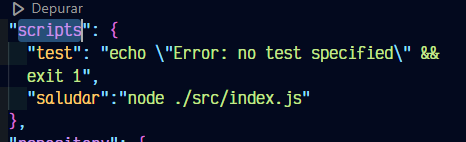
</div>

Par probar nuestro primer script personalizado nos vamos a nuestra terminal al inicio de nuestra carpeta _primeros-pasos_ y ejecutamos el comando:
```bash
npm run saludar
```

<div align="center">
    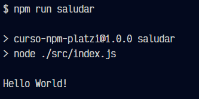
</div>

### Hacer varias acciones en un mismo comando
Ya vimos como hacer un script, pero solo ejecuta una tarea, que tal si intentamos hacer un script que realiza más de una tarea:
- En nuestro _package.json_ crearemos un nuevo script:
    ```json
    "actions":"node ./src/index.js && echo \"Realizando otra accion en un mismo comando"\"
    ```

<div align="center">
    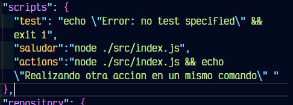
</div>

## NPX
__Node Package Execute (NPX)__ nos permite ejecutar acciones particulares sin tener que pasar por la instalación dentro de nuestro ordenador.
- Para fines educativos se hara un pequeño ejemplo de instalar la librería de React:
- Salimos de nuestra carpeta _primeros-pasos_ y creamos una nueva carpeta con _npx_:
    ```bash
    npx create-react-app my-first-app
    ```
- Escribimos "y" cuando nos pregunte en consola si deseamos instalarlo y esperamos la instalación
- Nos vamos a la carpeta _my-first-app_:
```bash
cd my-first-app
```
- Iniciamos el servidor de React:
```bash
npm start
```

## Actualización de Dependencias
Para fines educativos utilizaremos el siguiente [repositorio](https://github.com/gndx/react-base.git) para practicar
- Nos vamos a nuestra escritorio y creamos una nueva carpeta _practicas-updates-npm_, con la terminal nos movemos a esa carpeta y ejecutamos los siguiente comandos:
```bash
cd practicas-updates-npm
```
```bash
git clone https://github.com/gndx/react-base.git
```
```bash
mkdir react-base
```
Ahora veremos las dependencias de este proyecto:
```bash
npm list
```
Nos lanzará un mensaje de error, esto ocurre porque no tenemos las dependencias instaladas en nuestro ordenador, para eso ejecutamos el siguiente comando:
```bash
npm install
```
Ahora veremos si podremos ver la lsita de dependencias, pero eso no nos dice mucho de que tenemos que hacer, entonce podemos ejecutar este comando que nos indica que estamos instalando y que version deberiamos de tener para este proyecto:
```bash
npm outdate
```

<div align="center">
    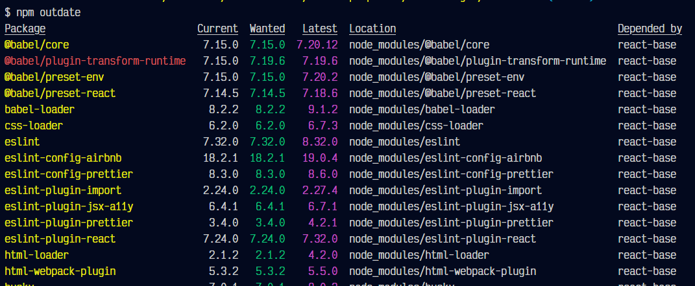
</div>
Para actualizar un paquete usamos lo que vimos anteriormente:

```bash
npm install react@latest
```
Al instalar a la ultima version nos dara un mensaje de error, porque hay otras dependencias que deben de ser actualizadas antes que _react_:

<div align="center">
    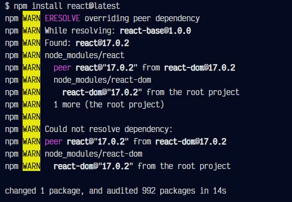
</div>

En este caso _react-dom_ dice que se debe de actualizar primero, entonces procedemos a realizarlo:

```bash
npm install react-dom@latest
```
Y ahora no nos dio ningun error, sin embargo aun tenemos varias cosas por actualizar...

<div align="center">
    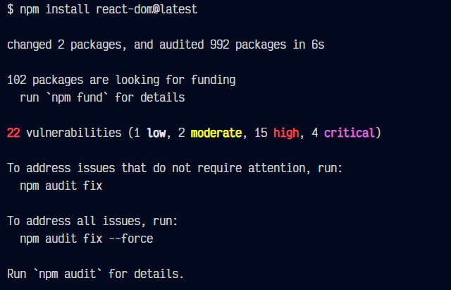
</div>

En la imagen que se mostro anteriormente dice que se pueden arreglar algunos de esos errores, pero veremos cuales son, con el sisguiente comando podremos ver cuales son los errores de las dependencias:

```bash
npm audit
```
Lanzara mucha información:
<div align="center">
    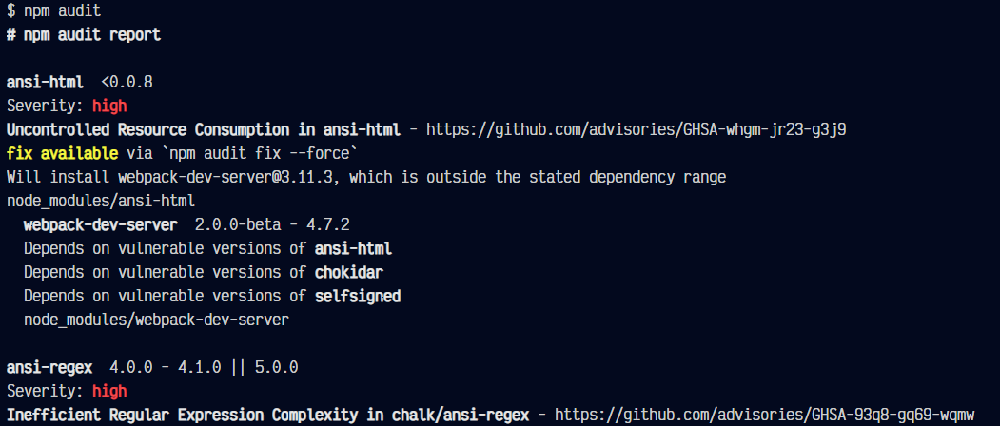
</div>
Ahora ¿Como lo arreglamos?, al final de todo ese mensaje nos da otra ayuda que dice que el programa intentara arreglar esos errores de manera automatica:
```bash
npm audit fix
```
Te daras cuenta que al final nos dice que quedan menos errores para corregir, significa que si funciono en algunas cosas.
<div align="center">
    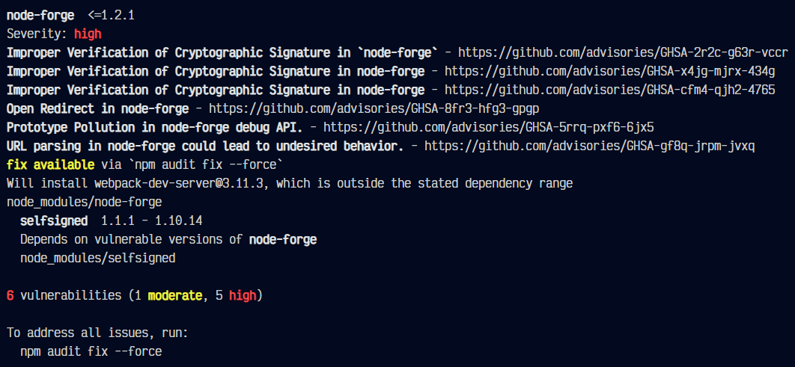
</div>
Pero aun quedan varias vulnerabilidades, entonces eso podria ser porque algunas dependencias tienen paquetes muy por debajo para actualizar, por lo que podremos usar otro comando que nos dice en la terminal:
```bash
npm audit fix --force
```
Este forzara a corregir más errores, pero en la imagen de abajo podemos ver que dice que algunos paquetes deberan ser actualizados manualmente:
<div align="center">
    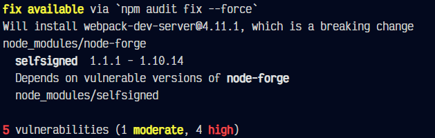
</div>
En este caso listamos las dependencias y vemos webpack

```bash
npm list
```
Podremos ver que son 3 dependencias
<div align="center">
    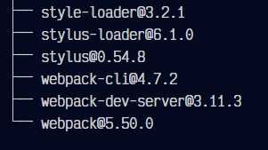
</div>

Entonces actualizamos webpack
```bash
npm install webpack@latest
```
<div align="center">
    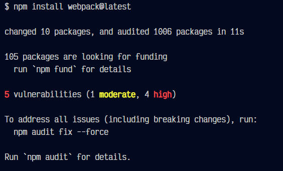
</div>
Luego con webpack-dev-server:

```bash
npm install webpack-dev-server@latest
```
Podemos ver que ya no tenemos vulnerabilidades o conflictos en todas las dependencias:
<div align="center">
    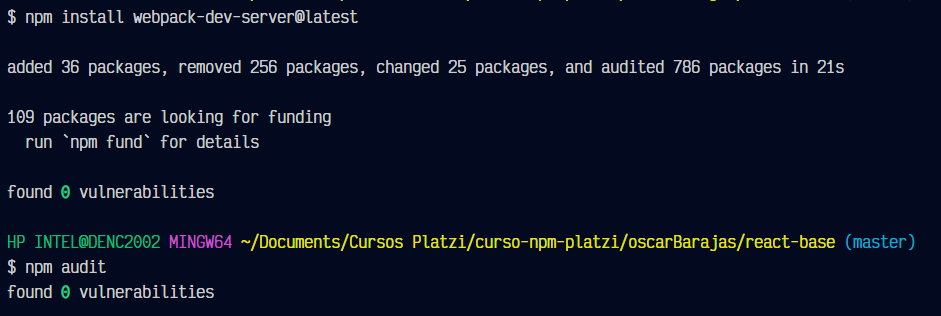
</div>